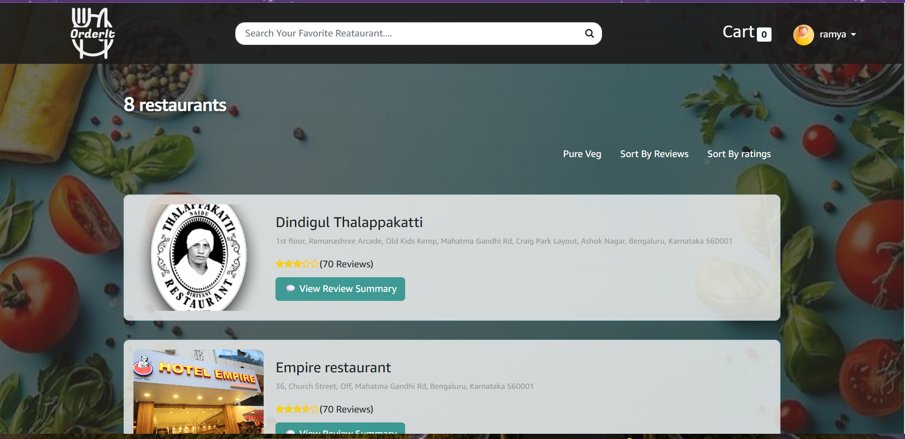
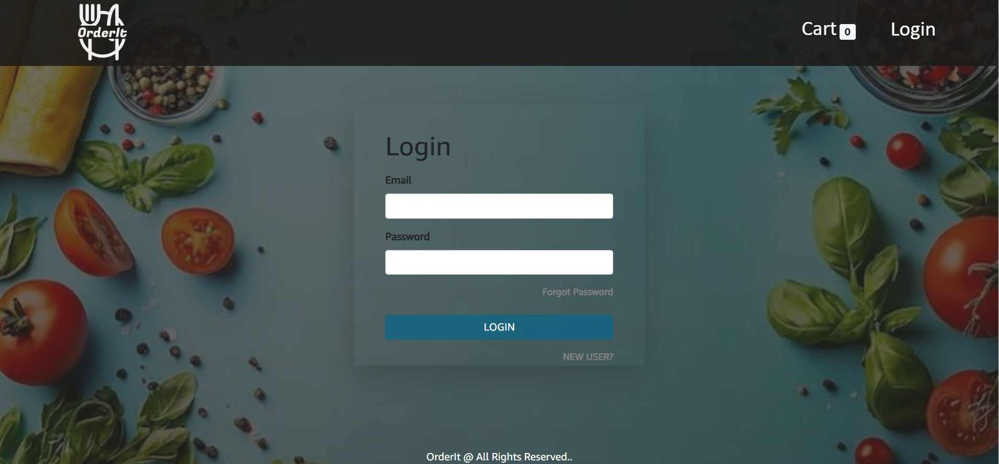
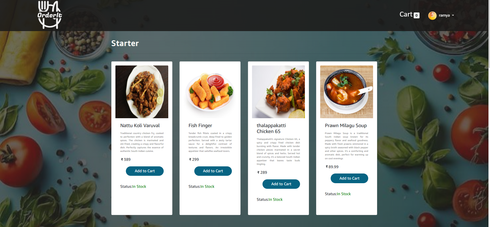
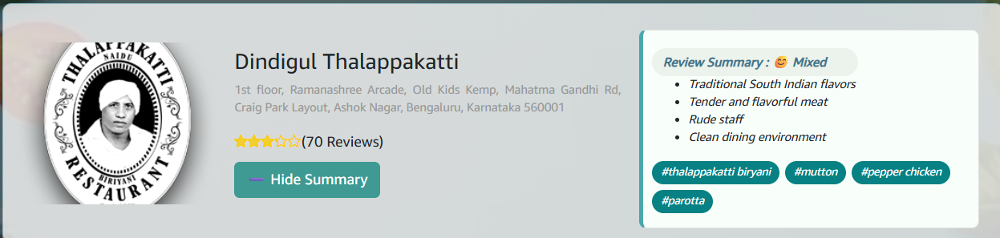
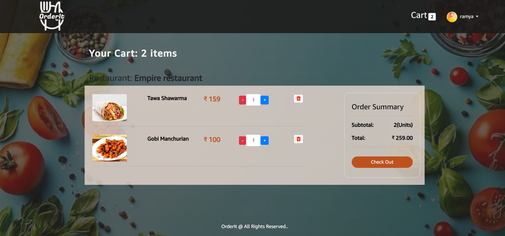
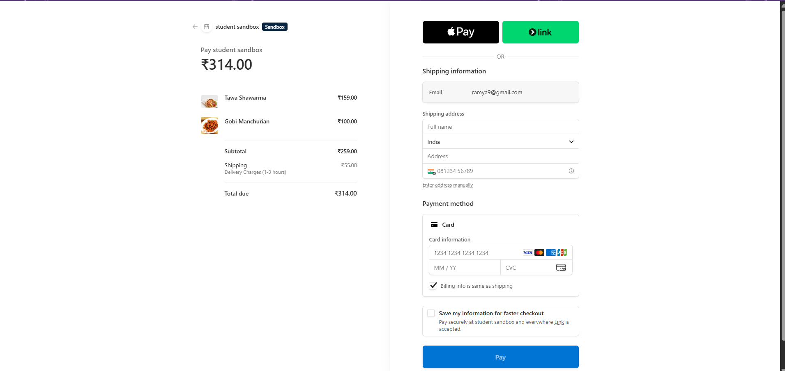
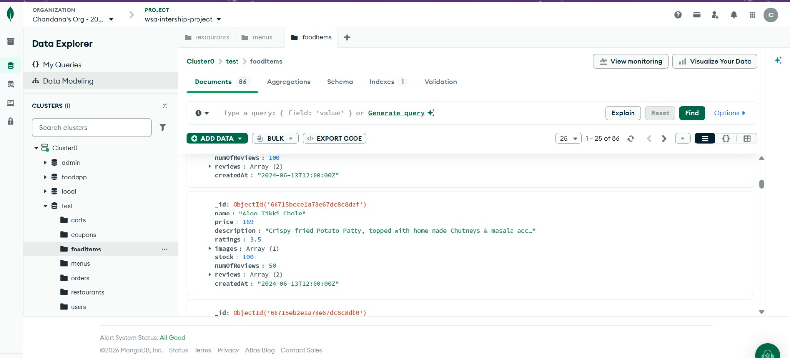

# 🍽️ Food Genie - AI Powered Food Ordering Application

An intelligent food ordering web application built using the MERN Stack with AI-powered review sentiment analysis, secure authentication, Stripe payment integration, and responsive UI.

# 🌐 Live Demo

**Live Application:** https://food-app-ai-five.vercel.app/

> The application is deployed using Vercel (Frontend) and Render (Backend).

---

# 🚀 Project Overview

This is a full-stack MERN application that allows users to browse restaurants, explore menus, add food items to cart, securely place orders, and analyze restaurant reviews using Artificial Intelligence.

The project integrates AI to automatically summarize customer reviews and identify the most frequently mentioned keywords, helping users make better food choices.

---

# ✨ Features

## 👤 User Features

- User Registration
- Secure Login using JWT
- Browse Restaurants
- Restaurant Search
- View Restaurant Details
- Browse Food Menu
- Add to Cart
- Remove from Cart
- Coupon Support
- Secure Stripe Payment
- Order Confirmation
- Responsive Design

---

## 🤖 AI Features

- AI Review Sentiment Analysis
- AI Generated Review Summary
- Top Mentioned Food Items
- Positive / Negative Review Detection
- Review Insights

---

## 👨‍💼 Admin Features

- Add Restaurants
- Delete Restaurants
- Add Menu Items
- Manage Orders
- AI Analysis Button
- Restaurant Management

---

# 🛠 Tech Stack

## Frontend

- React.js
- Redux Toolkit
- React Router
- Axios
- Bootstrap
- CSS
- Vite

---

## Backend

- Node.js
- Express.js

---

## Database

- MongoDB Atlas

---

## Authentication

- JWT Authentication

---

## Payment Gateway

- Stripe

---

## AI Integration

- Groq API (LLM)

---

# 🏗️ System Architecture

```text
                              +----------------------+
                              |        User          |
                              | (Web Browser Client) |
                              +----------+-----------+
                                         |
                                         | HTTP Requests
                                         |
                                         ▼
+---------------------------------------------------------------+
|               React.js Frontend (Vite)                        |
|---------------------------------------------------------------|
| • React Components                                            |
| • Redux Toolkit (State Management)                            |
| • React Router                                                |
| • Axios API Calls                                             |
| • Bootstrap + CSS                                             |
+---------------------------+-----------------------------------+
                            |
                            | REST API (JSON)
                            |
                            ▼
+---------------------------------------------------------------+
|             Node.js + Express.js Backend                      |
|---------------------------------------------------------------|
| • Authentication (JWT)                                        |
| • Restaurant APIs                                              |
| • Menu APIs                                                    |
| • Cart APIs                                                    |
| • Order APIs                                                   |
| • Coupon APIs                                                  |
| • AI Review Analysis APIs                                      |
| • Payment APIs                                                 |
+-----------+----------------------+----------------------------+
            |                      |                    |
            |                      |                    |
            ▼                      ▼                    ▼
+------------------+     +----------------+    +-----------------+
| MongoDB Atlas    |     | Stripe API     |    | Groq / OpenAI   |
|------------------|     |----------------|    |-----------------|
| • Users          |     | • Payments     |    | • Review        |
| • Restaurants    |     | • Checkout     |    |   Summaries     |
| • Menu Items     |     | • Transactions |    | • Sentiment     |
| • Orders         |     +----------------+    | • Top Mentions  |
| • Reviews        |                           +-----------------+
| • Coupons        |
+------------------+
```

---

# 📂 Project Structure

```
FoodProject
│
├── frontend
│   ├── src
│   ├── public
│   ├── package.json
│   └── vite.config.js
│
├── backend
│   ├── controllers
│   ├── models
│   ├── routes
│   ├── middleware
│   ├── config
│   ├── server.js
│   └── package.json
│
└── README.md
```

---

# 📸 Screenshots

## Home Page



---

## Login



---

## Restaurant menu



---

## AI Review Summary



---

## Shopping Cart



---

## Payment Page



---

## MongoDB Database



---

# ⚙ Installation

## Clone Repository

```bash
git clone https://github.com/Chandana999-chan/Food_App_AI.git
```

Go inside project

```bash
cd FoodProject
```

---

## Backend

```bash
cd backend

npm install

npm start
```

---

## Frontend

```bash
cd frontend

npm install

npm run dev
```

---

# 🔐 Environment Variables

Create a file

```
backend/config/config.env
```

Add

```
PORT=

DB_LOCAL_URI=

JWT_SECRET=

JWT_EXPIRES=

STRIPE_SECRET_KEY=

STRIPE_API_KEY=

CLOUDINARY_CLOUD_NAME=

CLOUDINARY_API_KEY=

CLOUDINARY_API_SECRET=

GROQ_API_KEY=
```

---

# 🔄 Project Workflow

1. User Login

       ↓

2. Browse Restaurants

       ↓

3. Select Food

       ↓

4. Add to Cart

       ↓

5. Stripe Payment

       ↓

6. Order Placed Successfully

       ↓

7. AI analyzes customer reviews

       ↓

8. AI displays summary and top mentions

---

# 📈 Future Enhancements

- AI Chatbot
- Live Order Tracking
- Google Maps Integration
- Email Notifications
- SMS Notifications

---

# 🎯 Learning Outcomes

During this project I learned

- MERN Stack Development
- React Hooks
- Redux Toolkit
- REST API Development
- JWT Authentication
- MongoDB Integration
- Stripe Payment Gateway
- AI API Integration
- State Management
- Full Stack Deployment
- Responsive UI Design

---

# Author

## Chandana K


---

# ⭐ If you like this project, don't forget to Star this repository.